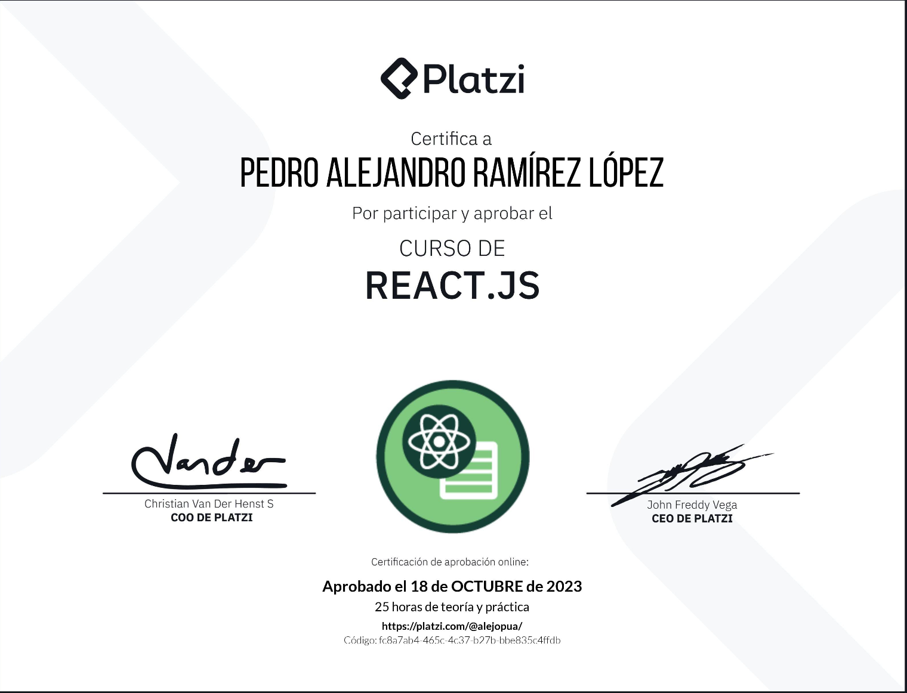

<h1 align="center">TodoApp</h1>

This project is a task manager developed with ReactJS, designed to help you manage your daily activities efficiently. It offers an intuitive interface and key functionalities for organising tasks and improving productivity.

<h2>Methodologies applied:</h2>

<h3>Componentization:</h3> Development based on functional components. This means that we break down the user interface into small reusable units called components. This facilitates maintenance, scalability and code reuse.

We use props and createContex to pass data between components.

<h3>Array methods used:</h3>
.map() method: We use the .map() method to dynamically traverse and render lists of items. 

.filter() method: We use the .filter() method to perform filtering and searching within our data lists. 

.forEach() method: To iterate over each element of an array and execute a function provided in each of them.

Method .findIndex():To search for an element in an array and return the index of the first occurrence that meets a specific condition.

.includes() method: To determine if a specific element exists in an array. 

<h3>Hooks:</h3>

useState: To manage internal states in components and updates according to user interactions.

useEffect: Execute code after the component is rendered.

useContext: To share data globally in an application.

<h3>Others:</h3>

ReactDOM.createPortal: To render content in a specific place in the DOM, as a root node independent of the main component tree. To create a floating element.

In short, my project was undertaken as an apprenticeship with the aim of honing my ReactJS skills and deepening my understanding of this technology to further my development as a programmer. Aiming for opportunities to collaborate on real-world projects alongside experienced developers, from whom I could gain valuable insights and knowledge.

### 🤝 Contributing

Contributions are what make the open source community such an amazing place to be learn, inspire, and create. Any contributions you make are **extremely appreciated**.

If you'd like to contribute:

1. Fork the Project
2. Create your Feature Branch (`git checkout -b feature/AmazingFeature`)
3. Commit your Changes (`git commit -m 'Add some AmazingFeature'`)
4. Push to the Branch (`git push origin feature/AmazingFeature`)
5. Open a Pull Request

Alternatively, you can simply clone this repository:

1. Clone this repository using the <strong>git clone</strong>
2. Install the project dependencies by running <strong>npm i</strong>
3. Start the application with the <strong>npm dev</strong>

<!-- CONTACT -->
### 📫 Contact   me

 
  
  
   

<!-- ACKNOWLEDGEMENTS -->
### Acknowledgements
* Platzi

<h1 align="center" >🏆 Certification</h1>

  

